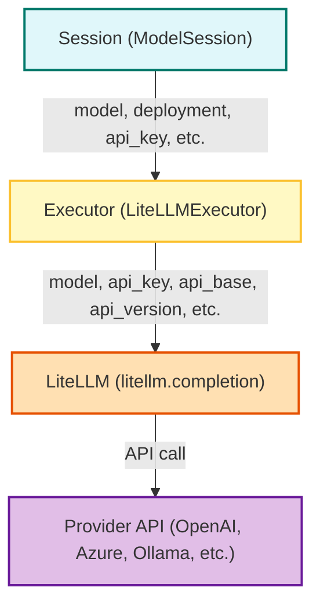

# Model Configuration Flow: Session → Executor → LiteLLM

This document explains how model configuration (model name, deployment, API keys, etc.) is passed through the FormalAI SDK stack, from the user session, through the executor, and finally to LiteLLM.

---

## Overview

The configuration flow for running a model call is:

```
Session (user-facing API)
   ↓
Executor (e.g., LiteLLMExecutor)
   ↓
LiteLLM (backend model runner)
```

---

## Mermaid Diagram



---

## Step-by-Step Flow

### 1. Session Layer (`ModelSession` or similar)
- **User code** creates a session, specifying:
  - `model` (e.g., `"azure/my-deployment"` or `"gpt-4.1"`)
  - Credentials (API key, etc.)
  - Optional: deployment name, API base, API version, etc.
- **Session** stores these config values and passes them to the executor.

### 2. Executor Layer (`LiteLLMExecutor`)
- **Executor** receives config from the session.
- It may:
  - Validate/normalize the model string (e.g., prepend `"azure/"` for Azure).
  - Collect all required LiteLLM parameters (`model`, `api_key`, `api_base`, `api_version`, etc.).
  - Passes these as arguments to `litellm.completion()`.

### 3. LiteLLM Layer
- **LiteLLM** receives all config as keyword arguments.
- It uses:
  - `model` (e.g., `"azure/my-deployment"`)
  - `api_key`, `api_base`, `api_version` (for Azure/OpenAI)
  - Any other provider-specific parameters
- **LiteLLM** makes the actual API call to the provider.

---

## Example: Azure OpenAI

**.env:**
```
AZURE_API_KEY=...
AZURE_API_BASE=...
AZURE_API_VERSION=2025-01-01-preview
AZURE_DEPLOYMENT_NAME=my-gpt4-deployment
```

**Session:**
```python
session = ModelSession(
    model=f"azure/{os.environ['AZURE_DEPLOYMENT_NAME']}",
    api_key=os.environ["AZURE_API_KEY"],
    api_base=os.environ["AZURE_API_BASE"],
    api_version=os.environ.get("AZURE_API_VERSION", "2025-01-01-preview"),
)
```

**Executor:**
```python
executor = LiteLLMExecutor(
    provider="azure",
    model=session.model,
    api_key=session.api_key,
    api_base=session.api_base,
    api_version=session.api_version,
)
```

**LiteLLM Call:**
```python
response = litellm.completion(
    model=executor.model,
    api_key=executor.api_key,
    api_base=executor.api_base,
    api_version=executor.api_version,
    messages=[{"role": "user", "content": "Hello"}]
)
```

---

## Key Points

- **Azure OpenAI** requires the model string to be `"azure/<deployment>"` and explicit Azure config.
- **OpenAI (non-Azure)** uses model names like `"gpt-4.1"` and only needs `api_key`.
- All config can be set via `.env` and loaded at the session or executor layer.
- The executor is responsible for mapping session config to the correct LiteLLM parameters.

---

## Configuration Options Matrix

This table summarizes which configuration options are required or supported for each provider/protocol.

| Provider/Protocol | Model String Format         | API Key         | API Base / Endpoint         | API Version         | Deployment Name      | Notes                                                                 |
|-------------------|----------------------------|-----------------|----------------------------|---------------------|----------------------|-----------------------------------------------------------------------|
| **Azure OpenAI**  | `azure/<deployment>`       | AZURE_API_KEY   | AZURE_API_BASE             | AZURE_API_VERSION   | AZURE_DEPLOYMENT_NAME| All required. Model string must be `azure/<deployment>`.              |
| **OpenAI (cloud)**| `gpt-4.1`, `gpt-3.5-turbo` | OPENAI_API_KEY  | (optional, defaults to OpenAI endpoint) | (n/a)              | (n/a)                | Only API key and model name needed.                                   |
| **Ollama**        | `ollama/<model>`           | (none)          | (optional, defaults to localhost)      | (n/a)              | (n/a)                | No API key required for local Ollama.                                 |
| **Other Providers**| (varies)                  | (varies)        | (varies)                   | (varies)            | (varies)             | See LiteLLM docs for provider-specific options.                       |

**Legend:**
- "Required" means the option must be set for that provider.
- "Optional" means the option can be omitted if using defaults.

---

## See Also

- [LiteLLM Documentation](https://github.com/BerriAI/litellm)
- [FormalAI SDK Executor Code](../../src/client/python/FormalAiSdk/models/litellm_executor.py)
- [Minimal Azure Check Example](../../src/client/python/FormalAiSdk/utils/check_litellm_minimal.py)
