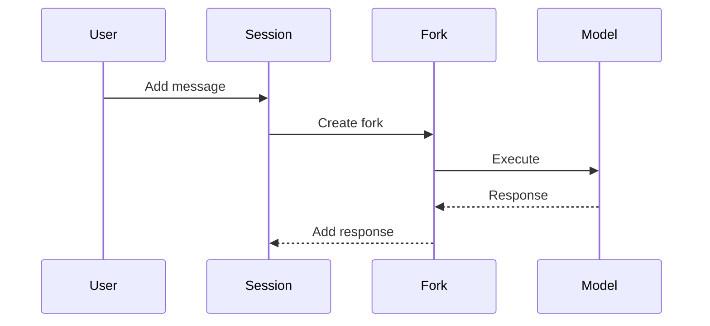
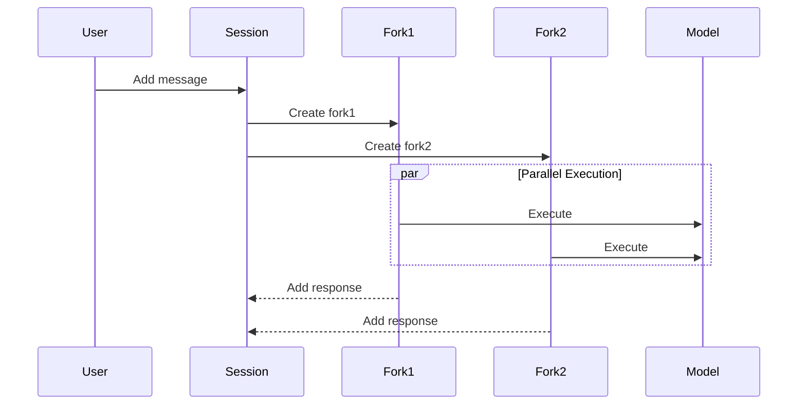
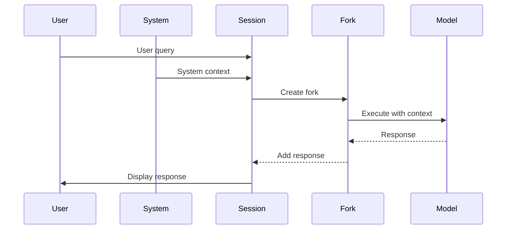
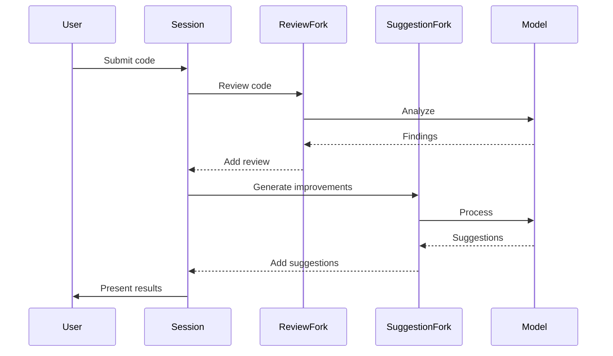

# SDK Usage Examples

This guide provides progressively complex examples of using the FormalAI Python SDK.

## 1. Basic Conversation

The simplest usage demonstrates a basic conversation with an AI model:



```python
from FormalAiSdk.models.litellm_executor import LiteLLMExecutor
from FormalAiSdk.sdk.session import ModelSession

# Initialize with Ollama
executor = LiteLLMExecutor("ollama", "llama2")
session = ModelSession("user", executor)

# Add user message
session.add_response("user", "What is Python?")

# Get AI response through a fork
fork = session.Fork("fork1", "user", "Explain Python programming language")
fork.Answer(session)

# View conversation
for msg in session.messages:
    print(f"{msg.actor}: {msg.content}")
```

## 2. Parallel Processing

Using multiple forks for concurrent processing:



```python
# Create multiple forks for parallel processing
fork1 = session.Fork("fork1", "user", "List Python advantages")
fork2 = session.Fork("fork2", "user", "List Python disadvantages")

# Execute in parallel
fork1.Answer(session)
fork2.Answer(session)
```

## 3. Advanced Conversation Management

Managing a complex conversation with multiple actors:



```python
# Add system context
session.add_response("system", "You are a Python expert")

# User query with context
session.add_response("user", "How do I optimize my Python code?")

# Create fork with context awareness
fork = session.Fork("optimization_fork", "user", """
Based on the conversation history and system context,
provide optimization recommendations
""")
fork.Answer(session)
```

## 4. Integration Pattern

Real-world example of a code review assistant:



```python
class CodeReviewAssistant:
    def __init__(self):
        self.executor = LiteLLMExecutor("ollama", "llama2")
        self.session = ModelSession("reviewer", self.executor)
    
    def review_code(self, code: str):
        # Add code for review
        self.session.add_response("user", f"Review this code:\n{code}")
        
        # Create review fork
        review_fork = self.session.Fork(
            "review_fork",
            "user",
            "Perform a detailed code review"
        )
        review_fork.Answer(self.session)
        
        # Create improvement suggestions fork
        suggest_fork = self.session.Fork(
            "suggest_fork",
            "user",
            "Suggest specific improvements"
        )
        suggest_fork.Answer(self.session)
        
        # Get results
        return self._format_results()
    
    def _format_results(self):
        # Format and return the review results
        results = []
        for msg in self.session.messages:
            if msg.actor in ["review_fork", "suggest_fork"]:
                results.append({
                    "type": msg.actor,
                    "content": msg.content
                })
        return results
```

Each example builds upon the previous ones, demonstrating:
- Basic conversation flow
- Parallel processing capabilities
- Complex conversation management
- Real-world integration patterns

Key points to remember:
1. Always initialize the executor and session first
2. Use meaningful fork IDs
3. Consider the conversation context
4. Handle responses appropriately
5. Clean up resources when done
