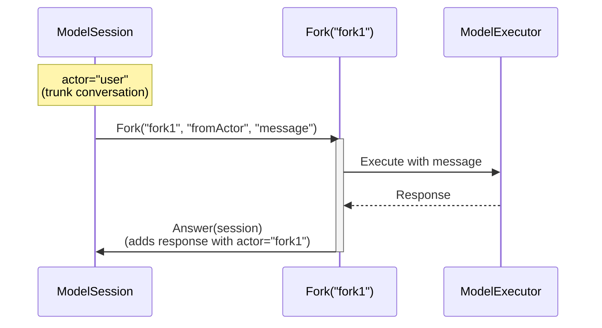

# Model Execution SDK Specification

## Overview
This SDK provides a unique approach to model execution through a forking mechanism where model responses are handled through isolated forks that feed back into a main trunk conversation. Each fork is tagged with a unique identifier and can execute model responses that are then merged back into the main conversation flow.



## Core Components

### ModelSession
The primary class managing the trunk conversation:

```python
class ModelSession:
    def __init__(self, actor: str):
        """
        Initialize a new trunk conversation.
        
        Args:
            actor: The actor who owns the trunk conversation
        """
        
    def Fork(self, fork_id: str, from_actor: str, message: str) -> ModelFork:
        """
        Create a new fork for model execution.
        
        Args:
            fork_id: Unique identifier for this fork
            from_actor: Actor whose message is being responded to
            message: The message to respond to
            
        Returns:
            A ModelFork instance configured to execute the response
        """
        
    def add_response(self, actor: str, response: str) -> None:
        """
        Add a response to the trunk conversation.
        
        Args:
            actor: The actor providing the response
            response: The response content
        """
```

### ModelFork
Handles isolated model execution and response integration:

```python
class ModelFork:
    def __init__(self, fork_id: str, from_actor: str, message: str):
        """
        Initialize a new execution fork.
        
        Args:
            fork_id: Unique identifier for this fork
            from_actor: Actor whose message is being responded to
            message: The message to respond to
        """
        
    def Answer(self, session: ModelSession) -> None:
        """
        Execute the model and add its response to the session.
        
        Args:
            session: The trunk conversation to add the response to
        """
```

## Core Concepts

### 1. Trunk Conversation
- Main conversation thread managed by ModelSession
- Maintains ordered sequence of interactions
- Each interaction includes:
  - Actor identifier
  - Message content
  - Timestamp

### 2. Execution Forks
- Created to handle model responses
- Each fork:
  - Has unique identifier
  - Knows source actor and message
  - Executes model
  - Merges response back to trunk

### 3. Response Flow
1. User message added to trunk conversation
2. Fork created with:
   - Unique fork ID
   - Reference to user (from_actor)
   - Message to respond to
3. Fork executes model
4. Response added back to trunk with fork ID as actor

### 4. Actor Types
- User actors (trunk conversation owners)
- Fork actors (model response handlers)
- System actors (optional for control messages)

## Error Handling

### Exception Types
```python
class FormalAIError(Exception):
    """Base exception class for all SDK errors."""

class ExecutionError(FormalAIError):  
    """Raised when model execution fails."""

class ValidationError(FormalAIError):
    """Raised for invalid inputs (e.g., duplicate fork IDs)."""
```

## Implementation Guidelines

### 1. Thread Safety
- Trunk conversation must handle concurrent additions
- Fork execution should be isolated
- Response merging must be thread-safe

### 2. Memory Management
- Maintain efficient conversation history
- Clean up completed forks
- Optimize response storage

### 3. Performance Considerations
- Lightweight fork creation
- Efficient response merging
- Optional response caching

## Usage Example
```python
# Create trunk conversation
session = ModelSession(actor="user")

# Add user message
session.add_response("user", "Hello!")

# Create fork and get response
fork = session.Fork("fork1", "user", "Hello!")
fork.Answer(session)  # Executes model and adds response

# Continue conversation
session.add_response("user", "What's the weather?")
fork2 = session.Fork("fork2", "user", "What's the weather?")
fork2.Answer(session)
```

## Implementation Notes
1. Fork IDs must be unique within a session
2. Responses are added in order received
3. Model execution details abstracted in fork
4. All operations should be atomic
5. Consider implementing response callbacks
