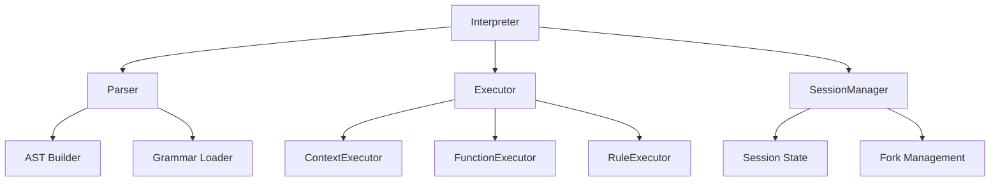

# AgentLingua Interpreter Implementation

## Overview
A Python-based interpreter for AgentLingua that executes blocks step-by-step using FormalAI SDK sessions. This design focuses on maintainability and practical implementation without over-engineering.

## Core Components



### 1. Parser
Uses existing Lark-based parser (`test_peg_parser.py`) to build AST:

```python
class AgentLinguaParser:
    def __init__(self):
        self.grammar = self._load_grammar()
        self.lark_parser = Lark(self.grammar, start="start", parser="earley")
    
    def parse(self, source: str) -> Tree:
        return self.lark_parser.parse(source)
```

### 2. Session Manager
Handles FormalAI SDK integration and conversation state:

```python
class SessionManager:
    def __init__(self, executor: LiteLLMExecutor):
        self.session = ModelSession("agent", executor)
        self.active_fork = None
    
    def create_fork(self, id: str, prompt: str) -> None:
        self.active_fork = self.session.Fork(id, "agent", prompt)
    
    def execute_fork(self) -> str:
        return self.active_fork.Answer(self.session)
```

### 3. Block Executors
Simple executor classes for each block type:

```python
class ContextExecutor:
    def execute(self, node: Tree, session: SessionManager) -> str:
        # Extract context content
        content = node.children[1].value if len(node.children) > 1 else ""
        # Create and execute fork with context
        session.create_fork("context", content)
        return session.execute_fork()

class FunctionExecutor:
    def execute(self, node: Tree, session: SessionManager) -> str:
        name = node.children[0].value
        inputs = self._extract_inputs(node)
        action = self._extract_action(node)
        # Create fork with function execution
        session.create_fork(f"func_{name}", action)
        return session.execute_fork()

class RuleExecutor:
    def execute(self, node: Tree, session: SessionManager) -> str:
        condition = self._extract_condition(node)
        then_block = self._extract_then(node)
        else_block = self._extract_else(node)
        # Create condition evaluation fork
        session.create_fork("rule_condition", condition)
        result = session.execute_fork()
        # Execute appropriate block based on condition
        if "true" in result.lower():
            return self._execute_block(then_block, session)
        return self._execute_block(else_block, session)
```

### 4. Main Interpreter
Coordinates parsing and execution:

```python
class AgentLinguaInterpreter:
    def __init__(self, model: str = "llama2"):
        self.parser = AgentLinguaParser()
        self.executor = LiteLLMExecutor("ollama", model)
        self.session = SessionManager(self.executor)
        
        # Block executors
        self.executors = {
            "context": ContextExecutor(),
            "function": FunctionExecutor(),
            "rule": RuleExecutor()
        }
    
    def execute(self, source: str) -> str:
        # Parse source
        ast = self.parser.parse(source)
        
        # Execute each block
        results = []
        for node in ast.children:
            if node.data in self.executors:
                result = self.executors[node.data].execute(node, self.session)
                results.append(result)
        
        return "\n".join(results)
```

## Implementation Strategy

### Phase 1: Basic Execution
1. Implement base parser integration
2. Basic block execution with session forks
3. Simple natural language handling

### Phase 2: Enhanced Features
1. Input parameter support
2. Improved condition evaluation
3. Context state management

### Phase 3: Optimization
1. Fork reuse optimization
2. Error handling improvements
3. Performance enhancements

## Example Usage

```python
# Initialize interpreter
interpreter = AgentLinguaInterpreter()

# Execute AgentLingua code
source = """
context
--begin
You are a helpful AI assistant.
--end

function greet {
    action [Greet the user warmly]
}

rule check.input {
    if [User provided name] then {
        action [Personalized greeting]
    } else {
        action [Generic greeting]
    }
}
"""

result = interpreter.execute(source)
print(result)
```

## Error Handling

```python
class AgentLinguaError(Exception):
    pass

class ParseError(AgentLinguaError):
    pass

class ExecutionError(AgentLinguaError):
    pass
```

Basic error handling focuses on:
1. Parser errors (syntax, grammar)
2. Execution errors (session, fork)
3. Content validation errors

## Testing Strategy

1. Unit Tests:
```python
def test_context_execution():
    interpreter = AgentLinguaInterpreter()
    source = """
    context
    --begin
    Test context
    --end
    """
    result = interpreter.execute(source)
    assert result and isinstance(result, str)
```

2. Integration Tests:
```python
def test_full_interaction():
    interpreter = AgentLinguaInterpreter()
    source = """
    context
    --begin
    You are a test agent.
    --end

    function test {
        action [Run test sequence]
    }
    """
    result = interpreter.execute(source)
    assert "test" in result.lower()
```

## Limitations

1. Current Version:
- Single session per interpreter
- Sequential block execution
- Basic error handling

2. Future Considerations:
- Parallel fork execution
- Advanced state management
- Performance optimization
